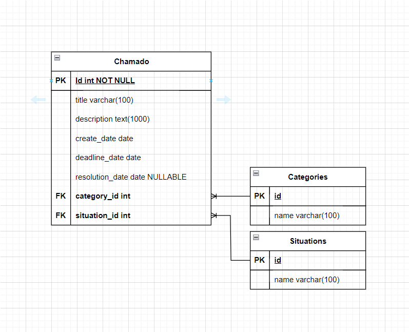

# Diagrama dos relacionamentos das entidades do sistema.


# Instruções para Instalação do Projeto Call Management Laravel

## Requisitos
Necessário ter em sua máquina:
- [XAMPP](https://www.apachefriends.org/index.html) (PHP, MySQL, Apache)
- PHP configurado no PATH do sistema
- [Composer](https://getcomposer.org/)
- [Git](https://git-scm.com/)

## Como instalar a build em sua máquina

1. **Crie uma pasta e abra no editor**:
   - Crie uma nova pasta em seu sistema.
   - Abra essa pasta no VS Code ou no editor de sua preferência.

2. **Clone o repositório do GitHub**:
   - Abra o terminal do VS Code.
   - Clone o repositório com o seguinte comando:
     ```sh
     git clone https://github.com/Danillohz/Call-Management-Laravel.git
     ```

3. **Entre no diretório do projeto**:
   - Navegue até o diretório do projeto clonado:
     ```sh
     cd Call-Management-Laravel
     ```

4. **Instale as dependências com Composer**:
   - Execute o comando abaixo para instalar as dependências do projeto:
     ```sh
     composer install
     ```

5. **Configure o arquivo de ambiente**:
   - Copie o arquivo `.env.example` para `.env`:
     ```sh
     cp .env.example .env
     ```
   - Dentro do arquivo .env Certifique-se de que DB_USERNAME e DB_PASSWORD condizem  com suas configurações
    

6. **Gere uma nova chave de aplicativo**:
   - Gere uma nova chave de aplicativo executando:
     ```sh
     php artisan key:generate
     ```
     
7. **Execute o XAMPP no modo administrador**:
   - Clique em start no Mysql e Apache

8. **Execute as migrações do banco de dados**:
   - Execute as migrações para criar as tabelas do banco de dados:
     ```sh
     php artisan migrate
     ```
   - Se o comando perguntar se você quer criar o banco de dados, digite `yes`.

9. **Inicie o servidor local**:
   - Inicie o servidor local do Laravel:
     ```sh
     php artisan serve
     ```
   - Clique no link que aparecerá no terminal (`http://127.0.0.1:8000` ou semelhante) para acessar a aplicação.

## Possíveis erros
1. **PHP não reconhecido pelo VS Code**
    - Em **Este Computador** clique com o botão direito do mouse e vá para propriedades
    - Após clique em **Configurações avançadas do sistema** e **Variáveis de Ambiente**
    - Selecione **Path** clique em editar e depois em novo
    - Coloque o caminho do PHP do XAMPP (`C:\xampp\php`)
    - 
2. **Erro ao dar o comando composer install**
    - Vá para a pasta (`C:\xampp\php`)
    - Abra o arquivo php.ini
    - Procure por (`;extension=zip`)
    - remova o ->(`;`), e salve o arquivo
